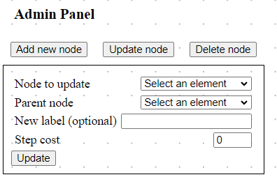

# Treenity

---
## Introduction

Treenity is a tool created in the Java programming language with the aim of enabling users to create, edit, and manage hierarchical tree structures. This documentation describes the structure, functionalities, and how to use this application.

The application allows for the creation, editing, deletion, and storage of numerical data in tree nodes. Additionally, it automatically calculates sums of values along the paths leading to the root of the tree, facilitating data analysis. Details under the [link](./docs/task.md).

### Technologies used in the application 
* Java 17
  * Spring
  * Hibernate
* React 18
  * React flow
  * Dagre
* Postgres
* Docker

---
## Table of Contents
1. [Quick reference guide](#quick-reference-guide)
2. [Application launch](#application-launch)
3. [Usage description](#usage-description)

---
## Quick reference guide
```bash
# commands to be executed in the root directory
cp .env.template .env
# !fill in the values of the variables in the .env file

docker compose up --build -d
./test/mock-database.sh
```

---
## Application launch
### Environment preparation
Create an `.env` file according to the template found in the `.env.template` file. You can copy the file and fill in the missing values. It is important that the file with the variables is named `.env` and that it is in the same folder as `docker-compose.yml`. Docker compose automatically retrieves the variables found in the `.env` configuration file.
```bash
cp .env.template .env
# fill in the values of the variables in the .env file
```

### Local activation of the application
#### Docker method
To build and run the application go to the root directory and use the following command.
```bash
docker compose up --build -d
```
If you want to disable containerization you should use the following command.
```bash
docker compose stop
```

#### Developer method
During development work, it will be more convenient to enable each component separately. The following describes the way using the IntelliJ premium environment.
* Postgres database - Docker, IntelliJ IDE
  * Set variables in `.env` file.
  * Use IDE to create and run docker container. </br></br> 
* Backend - IntelliJ IDE
  * Change path to database in `application.properties`
    * from `jdbc:postgresql://treenity-db:5432/postgres` 
    * to `jdbc:postgresql://localhost:5432/postgres`
  * Set the environment variables for `POSTGRES_USER` and `POSTGRES_PASSWORD` similar to the ones you set in `.env` file (see screen) and run the main program class with IntelliJ. </br></br> 
* Frontend - terminal
  * Go to `/frontend` directory 
  * Run `npm install`
  * Run `npm start`

### Initialization test data for the database
After setting docker with database, there is a possible to set default tree for tests. Just use script `mock-database.sh` that is located in `test` directory. Script can be executed from any directory.

```bash
# go to root directory and run
./test/mock-database.sh
```

---
## Usage description
The application includes a single screen. The user can see the existing tree structure. To modify the tree (or rather the forest), use the administration panel. Initially, the forms for modifying the tree are hidden, they can be easily revealed using the appropriate button.


Explanation of the meaning of form fields
* **Node to {** *update/delete* **}** - indication of node to update/delete.
* **Parent node** - indication of a parent by the label shown on the graph.
* **Label** - name displayed on the graph.
* **Step cost** - value of the path directly connecting to the node.

### Add new node
* Form allows you to add new nodes to the tree. 
* If the user does not select any `parent`, the node being added will be triangulated as the next root, and the `step cost` will be ignored. 
* `Label` is **required**.


### Update node
* Form to modify the nodes already present. 
* The required field is `Node to update` field indicating the node to be modified. 
* If no parent is indicated, the node will become root. 
* If the `label` does not change, it will remain the same as before. 
* `Step cost` always overwrites old value. 
* It is possible to assign a parent and a child by places.



### Delete node
* Form for deleting existing nodes
* `Node to delete` indicate label of the node to be removed.
* Deletion proceeds in cascade - removal of parent removes all children.

