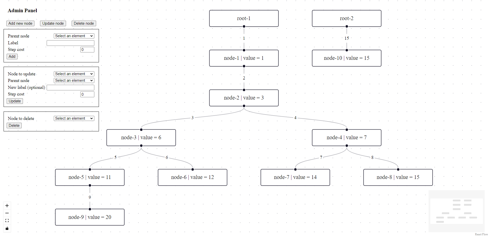
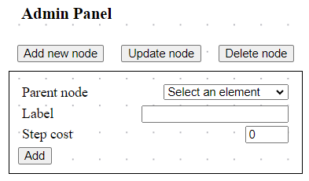
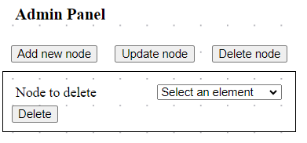

# Treenity

---
## Introduction

Treenity is a tool created in the Java programming language with the aim of enabling users to create, edit, and manage hierarchical tree structures. This documentation describes the structure, functionalities, and how to use this application.

The application allows for the creation, editing, deletion, and storage of numerical data in tree nodes. Additionally, it automatically calculates sums of values along the paths leading to the root of the tree, facilitating data analysis. Details under the [link](./docs/task.md).

### Technologies used in the application 
* Java 17
  * Spring
  * Hibernate
* React 18
  * React flow
  * Dagre
* Postgres
* Docker

---
## Table of Contents
1. [Quick reference guide](#quick-reference-guide)
2. [Application launch](#application-launch)
3. [Usage description](#usage-description)

---
## Quick reference guide
```agsl
// commands to be executed in the root directory
docker compose up --build -d
./test/mock-database.sh

docker compose stop
```

---
## Application launch
### Environment preparation
(todo)

### Local activation of the application
Activating the application can be done in several ways.

#### Docker method
(todo)
#### Developer method
(todo)

### Initialization of database
After setting docker with database, there is a possible to set default tree for tests. Just use script `mock-database.sh` that is located in `test` directory. Script can be executed from any directory.

---
## Usage description
The application includes a single screen. The user can see the existing tree structure. To modify the tree (or rather the forest), use the administration panel. Initially, the forms for modifying the tree are hidden, they can be easily revealed using the appropriate button.



### Add new node


### Update node


### Delete node
