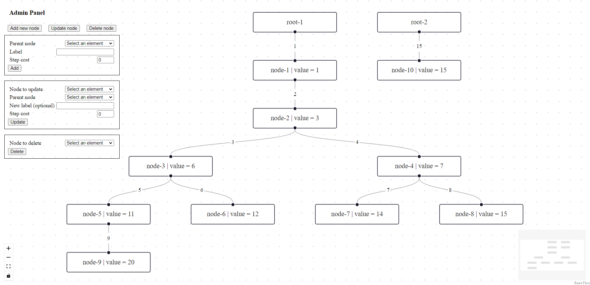
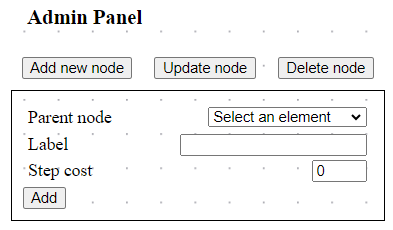
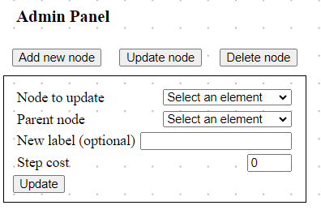
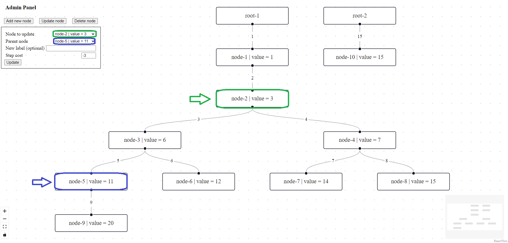
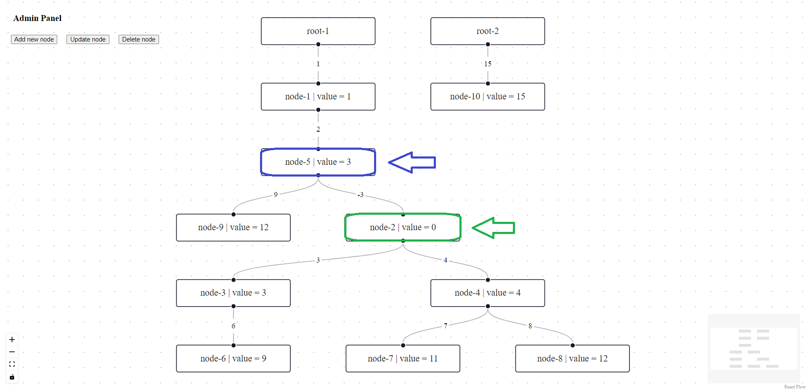
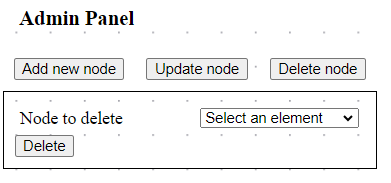

## Usage description
[back to README](./../README.md)

The application includes a single screen. The user can see the existing tree structure. To modify the tree (or rather the forest), use the administration panel. Initially, the forms for modifying the tree are hidden, they can be easily revealed using the appropriate button.

Explanation of the meaning of form fields
* **Node to {** *update/delete* **}** - indication of node to update/delete.
* **Parent node** - indication of a parent by the label shown on the graph.
* **Label** - name displayed on the graph.
* **Step cost** - value of the path directly connecting to the node.

### Add new node
* Form allows you to add new nodes to the tree.
* If the user does not select any `parent`, the node being added will be triangulated as the next root, and the `step cost` will be ignored.
* `Label` is **required**.

### Update node
* Form to modify the nodes already present.
* The required field is `Node to update` field indicating the node to be modified.
* If no parent is indicated, the node will become root.
* If the `label` does not change, it will remain the same as before.
* `Step cost` always overwrites old value.
* It is a possible to change order of nodes and set your child as your new parent (see screen).

### Delete node
* Form for deleting existing nodes
* `Node to delete` indicate label of the node to be removed.
* Deletion proceeds in cascade - removal of parent removes all children.

[back to README](./../README.md)
