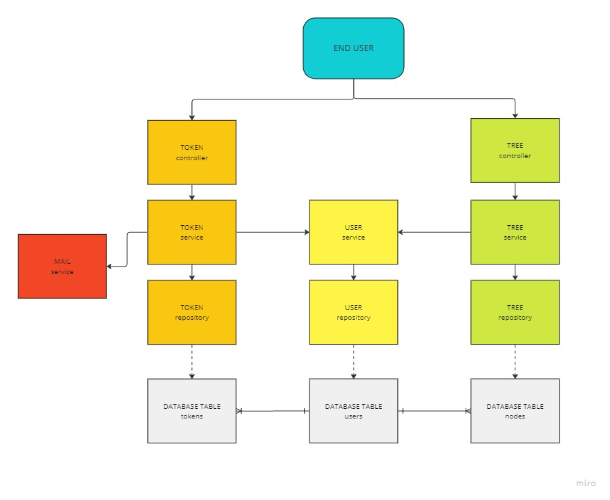

## User verification description
[back to README](./../README.md)

// TODO

### Backend class structure


### Endpoints
* Logged user
  * token endpoints
    * [POST] `/logout/{sessionToken}`
    * [POST] `/change-password/{sessionToken}` @body(ChangePasswordDTO)
  * tree endpoints
    * [GET] `/tree/{sessionToken}` - builds User's forest from database nodes
    * [POST] `/nodes` @body(NodeInstructionDTO) - add new node in User's forest
    * [PUT] `/nodes/{nodeId}` @body(NodeInstructionDTO) - update User's node
    * [DELETE] `/nodes/{nodeId}` @body(NodeInstructionDTO) - delete node and all it's children
* Un-logged user
  * token endpoints
    * [POST] `/login` @body(UserDTO)
    * [POST] `/registration` @body(UserDTO)
    * [GET] `/registration/{registartionToken}` - activation of new account
    * [POST] `/forgot-password` @body(ForgetPasswordDTO)
    * [GET] `/forgot-password/{resetToken}` - reset User's password; generation of random temporary password

### Structure of DTO classes
```java
public class UserDTO {
  private String username;
  private String password;
  private String email;
}

public class ChangePasswordDTO {
    private String currentPassword;
    private String newPassword;
}

public class ForgetPasswordDTO {
  private String email;
}
```

[back to README](./../README.md)